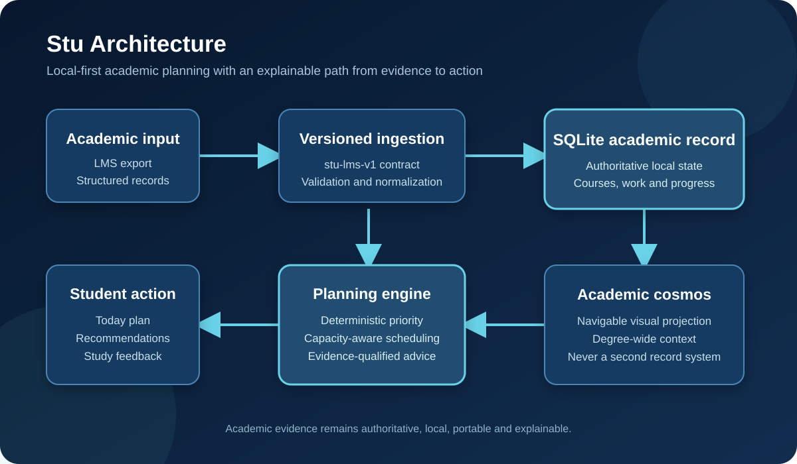

# Stu - Student Operating System

Stu is a student-focused software platform designed to turn academic obligations into an actionable, evidence-aware plan.

Rather than acting as another task list, Stu connects course requirements, assignments, deadlines, availability, progress, and study feedback so a student can understand what matters now, what fits into the time available, and why a recommendation was made.

> **Project status:** Private alpha  
> **Repository purpose:** Public portfolio showcase  
> **Canonical application source:** Maintained privately

## Product strategy

Students often manage coursework across an LMS, calendars, notes, reminders, and disconnected study tools. That fragmentation creates a planning problem: knowing that work exists is different from knowing what to do next.

Stu is being developed around five principles:

1. **One authoritative academic record** - SQLite remains the source of truth; visual interfaces are projections of that state.
2. **Actionable prioritization** - deadlines, importance, readiness, and available capacity contribute to a deterministic plan.
3. **Explainable recommendations** - advice should identify its supporting evidence and freshness instead of presenting opaque conclusions.
4. **Student control** - LMS integration is read-only; Stu does not submit or modify coursework.
5. **Local-first privacy** - academic data remains portable and under the student's control.

## Core capabilities

- Versioned `stu-lms-v1` ingestion contract
- Experimental Blackboard-oriented import workflow
- Canonical course, assignment, and completion records
- Deterministic priority ranking
- Capacity-aware study scheduling
- Progress and study-feedback adaptation
- Evidence-qualified recommendations
- Separation of course status from assignment submission state
- Local archival of completed coursework
- Release gates and feature-to-test traceability

## Academic cosmos

Stu includes an interactive visual model for understanding an entire degree:

| Academic concept | Visual representation |
| --- | --- |
| Degree | Galaxy cluster |
| Semester | Galaxy |
| Course | Stellar population |
| Assignment, exam, lab, or project | Star |
| Subtasks and resources | Planetary system |
| Prerequisite relationships | Filaments |

The visualization is not a second database. It is a navigable projection of Stu's authoritative academic state.

## Architecture

## Engineering evidence

The private canonical implementation currently has a **74-test passing suite** covering its verified behavior and release checks. Development uses explicit specifications, reproducible checkpoints, severity policy, and feature-to-test traceability to keep product claims tied to evidence.

A public test summary and sanitized demonstrations may be added here as the private-alpha release progresses.

## Technology

- Next.js and JavaScript
- SQLite
- Versioned JSON Schema contracts
- Deterministic planning and recommendation logic
- Automated verification

## Portfolio notice

This repository presents selected, sanitized materials from Stu for professional evaluation. The complete application and source code are proprietary and maintained privately.

See [LICENSE.md](LICENSE.md) for permitted use.
